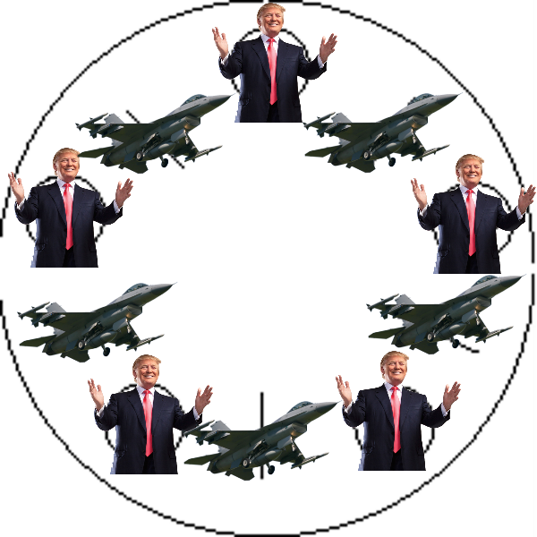

# Flyin Presidents Problem

The _Flyin Presidents Problem_ is a fully with JavaFx implemented Readlife
example of the popular _Dining Philosophers Problem_

## Contributors

- Gabriel Aigner
- Belmin Coralic

## Idea

### Basic Idea

The Basic Idea of our projekt is the normal _Dining Philosophers Problem_ concept.

### My Idea

```
Starting point is a G5 summit with five presidents who have their own plane at an airport.
However, there are only 5 Eurofighters that can take off and one president has to be accompanied by two Eurofighters.
So only two can fly at the same time.
```

Example picture:



## P.S. Entschuldigung wegen der verspäteten Abgabe!
